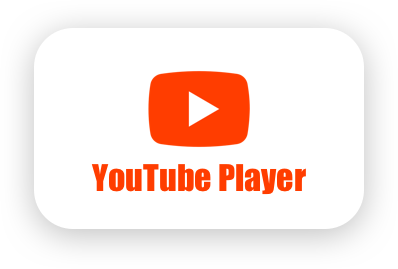

<p align="center" >
  
</p>

[](http://cocoadocs.org/docsets/EmojiPicker/)
[](http://cocoadocs.org/docsets/EmojiPicker/)
[](https://www.apache.org/licenses/LICENSE-2.0.html)
[](https://travis-ci.org/levantAJ/YouTubePlayer)

# YouTubeVideoPlayer
Library for embedding and controlling YouTube videos in your iOS applications!

<p align="center" >
  
</p>

## Requirements

- iOS 9.0 or later
- Xcode 9.0 or later

## Installation
There is a way to use YouTubeVideoPlayer in your project:

- Using CocoaPods
- Manually 

### Installation with CocoaPods

```
pod 'YouTubeVideoPlayer', '1.0'
```

### Manually

Manually drag file [YouTubeVideoPlayer.swift](https://github.com/levantAJ/YouTubeVideoPlayer/blob/master/YouTubeVideoPlayer/YouTubeVideoPlayer.swift) to your project. 

### Build Project

At this point your workspace should build without error. If you are having problem, post to the Issue and the
community can help you solve it.

## How To Use

```swift
import YouTubeVideoPlayer

let player: YouTubeVideoPlayer = .shared
player.isHidden = true
UIApplication.shared.keyWindow?.addSubview(player)
player.play(videoId: <#YouTube Video Id#>, sourceView: <#Source View#>)
```

### Handle events:

##### Delegate
[YouTubeVideoPlayerDelegate](https://github.com/levantAJ/YouTubeVideoPlayer/blob/master/YouTubeVideoPlayer/YouTubeVideoPlayer.swift)

```swift
player.delegate = self
```

+ `func youTubeVideoPlayer(_ player: YouTubeVideoPlayer, didStop videoId: String) {}`
+ `func youTubeVideoPlayer(_ player: YouTubeVideoPlayer, willPresent videoId: String) {}`
+ `func youTubeVideoPlayer(_ player: YouTubeVideoPlayer, didPresent videoId: String) {}`

##### Notifications:

- `YouTubeVideoPlayer.playerDidStop`
- `YouTubeVideoPlayer.playerWillPresent`
- `YouTubeVideoPlayer.playerDidPresent`

Examples:

- Setup event:

```swift
self.notificationCenter.addObserver(self, selector: #selector(playerWillPresent), name: YouTubeVideoPlayer.playerWillPresent, object: nil)
```

- Handle event:

```swift
@objc func playerWillPresent(_ notification: Notification) {
	guard let videoId = notification.userInfo?[YouTubeVideoPlayer.videoIdKey] as? String else { return }
}

```


- Get current YouTube video id:
```swift
player.videoId
```

- Make player is auto play, default is `true`
```swift
player.isAutoPlay = true
```

- Set looping, default is `true`:
```swift
player.isLooped = true
```

- Pause when idle, when user moves player to the edge, default is `false`
```swift
player.pauseWhenIdle = false
```

- Set player's maximum width, default is `500`
```swift
player.maxWidth = 500
```

## Author
- [Tai Le](https://github.com/levantAJ)

## Communication
- If you **found a bug**, open an issue.
- If you **have a feature request**, open an issue.
- If you **want to contribute**, submit a pull request.

## Licenses

All source code is licensed under the [MIT License](https://raw.githubusercontent.com/levantAJ/YouTubeVideoPlayer/master/LICENSE).
